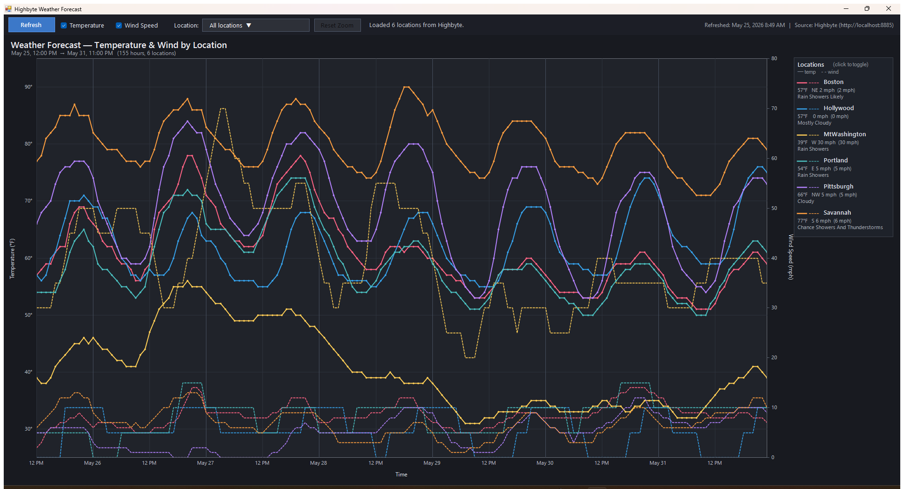

# WeatherPlot

A standalone Windows desktop app that plots hourly weather forecasts (temperature + wind speed) for multiple locations on a single interactive chart. Data is sourced from a [Highbyte](https://www.highbyte.com/) Intelligence Hub via its REST data API, with the National Weather Service's hourly forecast underneath.



---

## 1. Quick Start

1. Double-click `WeatherPlot.exe`.
2. The **Connect to Highbyte** dialog appears (see [§1.1](#11-the-connect-dialog)). Enter the server URL and either your credentials or a pre-issued bearer token, then click **Connect**.
3. On success, the main chart window opens. It loads from `weather_data.json` (if present) immediately, then refreshes in the background using the bearer token obtained from the login. New cache is written on every successful refresh, so the next startup works even offline (once you've authenticated).

No installer, no .NET SDK, no NuGet packages — just a single `.exe` plus a small JSON cache file and a tiny `connection.json` beside it.

### 1.1 The Connect Dialog

When the app launches, a modal **Connect to Highbyte** dialog comes up first. The main window never appears until you successfully authenticate (or cancel out, which exits the app).

The dialog has:

- **Server URL** — defaults to `http://localhost:8885`. If you omit the scheme, `http://` is added automatically. Trailing slashes are stripped.
- A mode toggle:
  - **Username & Password** *(default)* — calls `POST {url}/data/v1/login` with `{"username":"...", "password":"..."}` and reads `access_token` from the response. That token becomes the bearer token used for all subsequent API calls in this session.
  - **Bearer Token** — paste a pre-issued token directly. Use this when the Highbyte server has *Allow Login Authentication* disabled (you'll see an HTTP 403 from the Login mode in that case), or when you already have a service token.
- **Connect** / **Cancel** buttons. **Enter** triggers Connect; **Esc** triggers Cancel.

Error messages appear in red below the form for invalid URL, bad credentials (HTTP 401), or the *Allow Login Authentication* setting being disabled on the server (HTTP 403, with a hint to switch to Bearer Token mode).

#### Persistence

The dialog reads and writes a small `connection.json` file next to the .exe:

```json
{ "Url": "http://localhost:8885", "Username": "admin", "UseToken": false }
```

The URL, last-used username, and last-used mode are remembered for next launch. **The password and bearer token are never saved to disk.**

---

## 2. The Chart

The chart fills the main window. It plots **time** on the X-axis and supports two simultaneous Y-axes:

| Axis | Side | Series style | Units |
|---|---|---|---|
| Temperature | Left | Solid line, 2 px | °F |
| Wind Speed | Right | Dashed line, 1.6 px | mph |

Each location is rendered in its own color (from a fixed 8-color palette). Both temperature and wind-speed lines for one location share that color, so you read by hue and distinguish series type by line style.

### Chart elements

- **Title**: reflects what series are shown ("Temperature & Wind by Location", "Temperature by Location", "Wind Speed by Location", or "(no series selected)").
- **Subtitle**: shows the visible time range, count of hours, count of visible locations, and a `[zoomed: X of Y h]` indicator when zoomed.
- **Gridlines**: horizontal at "nice" temperature steps (e.g. every 5°F); vertical at hourly markers (every 2/6/12 hours depending on zoom). Day boundaries get a slightly brighter vertical line.
- **Hover tooltip**: when the cursor is near a data point, a tooltip appears showing the location name, day/time, temperature in °F, wind direction + speed, and the NWS short forecast (e.g. "Rain Showers Likely"). Tooltip indicates whether you've snapped to a `(temp)` or `(wind)` point.
- **Legend panel** (right side): one card per location showing the line-style legend (— temp, - - wind), name, current temperature, current wind direction + speed, and current forecast. Hidden locations are dimmed with a strike-through on the name.
- **Empty state**: if no data is loaded yet, the chart says *"No data loaded. Click Refresh to fetch current forecast."* If all locations or all series types are turned off, an informative subtitle appears in place of the time range.

---

## 3. Toolbar

The top toolbar (44 px tall, left to right):

| Control | Behavior |
|---|---|
| **Refresh** | Pulls fresh data from Highbyte: `POST /data/v1/pipelines/GetLocations/value` then a `GetForecastForLocation` call per location. Updates the chart and overwrites `weather_data.json`. |
| **Temperature** checkbox | Show/hide the solid temperature lines and the left Y-axis. |
| **Wind Speed** checkbox | Show/hide the dashed wind-speed lines and the right Y-axis. |
| **Location:** dropdown button | Opens a popup with **Select All** + a checkbox list of every location (see §4). The button label summarizes the current selection. |
| **Reset Zoom** | Restore the full data time range. Dimmed when not zoomed; brightens when a zoom is active. |
| **Status** label | Live progress text during refresh (`"Fetching Pittsburgh forecast … (4/6)"`) or summary after load (`"Loaded 5 locations from Highbyte."`). Shows errors if any locations failed. |
| **Refreshed / Cached** label (far right) | Last refresh time + source URL, e.g. `Refreshed: May 24, 2026 9:28 PM | Source: Highbyte (http://localhost:8885)`. If a refresh hasn't run yet, shows the cache timestamp. |

---

## 4. Multi-Select Location Dropdown

Click the **Location:** button to open the dropdown popup. It contains:

- A bulk-action row at the top with two buttons:
  - **Select All** (blue) — checks every location at once.
  - **Unselect All** (gray) — clears every checkbox at once (the chart goes empty, showing the *"No locations visible"* state).
- A checkbox list of every location returned by Highbyte. Click any row to toggle that location's visibility.

The chart updates **live** as you check / uncheck — no need to close the popup. Click anywhere outside the popup to dismiss it. Both bulk-action buttons leave the popup open so you can adjust further (e.g. *Unselect All* → manually check just the two locations you want).

### Button label conventions

| Selection state | Button text |
|---|---|
| Everything checked (default) | `All locations ▼` |
| Nothing checked | `(none selected) ▼` |
| Exactly 1 checked | `<Name> ▼` |
| Exactly 2 checked | `<Name1>, <Name2> ▼` |
| 3+ checked | `N locations selected ▼` |

### Persistence

When you refresh data, your selection is preserved by location name. New locations added on the Highbyte side default to checked. Removed locations silently disappear.

The location dropdown and the legend-row click toggle are two independent ways to do the same thing — they stay in sync.

---

## 5. Chart Interactions

### Click

- **Click a legend row** → toggle that location's visibility (chart rescales axes to fit what's left). Equivalent to checking/unchecking that row in the dropdown.

### Hover

- **Move the cursor over the chart** → snap-to-nearest-point tooltip appears. Both temperature and wind points are candidates.
- **Hover a legend row** → cursor turns into a pointing hand to indicate clickability.

### Scroll wheel — Zoom

- **Scroll up** over the chart → zoom in on the time axis by 1/1.25× per notch.
- **Scroll down** → zoom out by 1.25× per notch.
- Zoom is **centered at the cursor's X position**, so the time you're pointing at stays anchored as you zoom.
- The Y-axis (and wind axis) auto-rescale to fit the data within the visible window, so a narrow zoom over a single day shows that day's actual temperature range using the full chart canvas.
- Hard limits: can't zoom in tighter than 1 hour; can't zoom out beyond the full data range.
- The subtitle gains a `[zoomed: 40 of 155 h]` annotation when active.
- Click **Reset Zoom** in the toolbar to restore the full range.

Zoom level is preserved across location toggles, checkbox toggles, and data refreshes (clamped to the new data range if needed).

---

## 6. Data Source

### Highbyte endpoints

The app calls three Highbyte endpoints:

| Endpoint | HTTP | Body | Returns |
|---|---|---|---|
| `Login` | `POST /data/v1/login` | `{"username":"...", "password":"..."}` | `{"access_token":"...", "token_type":"...", "expires_in":N}` — called once at startup from the Connect dialog (skipped in Bearer Token mode). |
| `GetLocations` | `POST /data/v1/pipelines/GetLocations/value` | `{}` | `[{"Location":"Boston"}, …]` |
| `GetForecastForLocation` | `POST /data/v1/pipelines/GetForecastForLocation/value` | `{"Location":"<name>"}` | `[{"CurrentWeather":{…}, "WeatherForecast":[{…}, …]}]` |

Each forecast point has: `Time`, `Temperature` (°F), `WindSpeed` (string like `"12 mph"`), `WindDirection`, `Forecast` (NWS short text).

### Authentication

After the Connect dialog completes, every pipeline request carries `Authorization: Bearer <token>` where `<token>` was either returned by `/data/v1/login` or pasted in directly. TLS 1.2 is explicitly enabled for HTTPS deployments.

### Cache (`weather_data.json`)

Lives next to the .exe. Format:

```json
{
  "Locations": [
    {
      "Name": "Boston",
      "Forecast": [
        { "Time": "...", "Temperature": 52, "WindSpeed": "12 mph",
          "WindDirection": "E", "Forecast": "Rain Showers" },
        ...
      ]
    },
    ...
  ]
}
```

The cache is loaded synchronously on startup (instant display), then overwritten on every successful refresh.

---

## 7. Configuration

All connection configuration is done **interactively at startup** via the Connect dialog (see [§1.1](#11-the-connect-dialog)). There are no environment variables, command-line flags, or config files for URL/credentials.

The dialog persists three settings to `connection.json` next to the .exe so the next launch is one-click for the same server:

| Field | Persisted? | Purpose |
|---|---|---|
| `Url` | yes | Pre-fills the Server URL field |
| `Username` | yes | Pre-fills the Username field (Username & Password mode) |
| `UseToken` | yes | Selects which radio button is active when the dialog opens |
| Password | **never** | Re-entered each session |
| Bearer Token | **never** | Re-entered each session |

If `connection.json` is missing or corrupt, defaults (`http://localhost:8885`, empty username, Username & Password mode) are used.

---

## 8. Files

```
C:\Code\Claude\WeatherPlot\
├── WeatherPlot.exe           — the program
├── WeatherPlot.cs            — single-file C# source
├── weather_data.json         — local cache, auto-managed
├── connection.json           — saved URL + username + mode (no password/token)
├── screenshot*.png           — verification screenshots
├── README.md                 — this file
└── README.pdf                — printable version of this file
```

Single source file, single binary. No DLLs, no installer. `connection.json` is created on first successful login.

---

## 9. Building from Source

The project compiles with the .NET Framework 4.x C# compiler that ships with Windows — **no .NET SDK required**.

```powershell
$csc = "C:\Windows\Microsoft.NET\Framework64\v4.0.30319\csc.exe"
& $csc /nologo /target:winexe /platform:x64 /out:WeatherPlot.exe `
    /reference:System.dll `
    /reference:System.Core.dll `
    /reference:System.Drawing.dll `
    /reference:System.Windows.Forms.dll `
    /reference:System.Web.Extensions.dll `
    WeatherPlot.cs
```

The only references are framework assemblies (`System.Web.Extensions` is used for its `JavaScriptSerializer`, since `System.Text.Json` isn't available in .NET Framework 4.x).

Target runtime: any Windows 7+ machine with .NET Framework 4.x — already present on every modern Windows install.

---

## 10. Architecture

```
┌──────────────────────────────────────────────────────────────┐
│ MainForm  (System.Windows.Forms.Form)                        │
│ ┌──────────────────────────────────────────────────────────┐ │
│ │ topBar  (Panel, Dock=Top)                                │ │
│ │  [Refresh]  ☑ Temp  ☑ Wind  Location: [▼ ...]  [Reset]   │ │
│ │  Status: ...                          Refreshed: ...     │ │
│ └──────────────────────────────────────────────────────────┘ │
│ ┌──────────────────────────────────────────────────────────┐ │
│ │ chart   (ChartPanel : Panel, Dock=Fill)                  │ │
│ │  • Custom GDI+ drawing (no chart library)                │ │
│ │  • Dual Y-axes (temp left, wind right)                   │ │
│ │  • Hover, zoom, click-to-toggle legend                   │ │
│ │  • Anti-aliased lines, clear-type text                   │ │
│ └──────────────────────────────────────────────────────────┘ │
└──────────────────────────────────────────────────────────────┘
                              │
                              │ HighbyteClient (static)
                              ▼
              POST /data/v1/pipelines/<name>/value
                  Authorization: Bearer …
                              │
                              ▼
                         Highbyte
                  (typically port 8885)
                              │
                              ▼
                        NWS api.weather.gov
                       (Highbyte upstream)
```

### Key classes

| Class | Role |
|---|---|
| `LoginForm` | Modal Connect dialog: server URL + auth, calls `/data/v1/login`, configures `HighbyteClient` |
| `ConnectionSettings` | Load/save `connection.json` (URL + username + mode, never secrets) |
| `MainForm` | Form, toolbar wiring, refresh coordination, cache I/O |
| `ChartPanel` | Custom-drawn chart (GDI+), zoom/hover/legend interaction |
| `HighbyteClient` | HTTP client for login + the two data pipelines; configured at runtime via `Configure(url, token)` |
| `WindParser` | Extract leading numeric value from strings like `"12 mph"` |
| `LocationSeries` | Per-location data: `Times[]`, `Temperatures[]`, `WindSpeeds[]`, `Visible`, `Color` |
| `ForecastPoint` | One forecast hour: `Time`, `Temperature`, `WindSpeed`, `WindDirection`, `Forecast` |

### Threading

- HTTP fetches run on a thread-pool thread (`ThreadPool.QueueUserWorkItem` in `BeginRefresh`).
- UI updates marshal back via `BeginInvoke` (helper: `MainForm.UiInvoke`).
- During refresh, the **Refresh** button is disabled, the status label streams progress, and the chart only updates once at the end.

---

## 11. Defensive Design Notes

This app picked up a few hardenings during development:

- **`OnLoad` state reset + `formReady` flag**: handlers no-op while the form is initializing, then `OnLoad` explicitly asserts the known-good defaults. Prevents spurious events (e.g. from injected keystrokes during window show) from corrupting initial state.
- **`MouseClick` instead of `Click` on the toolbar checkboxes**: spacebar / synthetic keys can fire `Click` but not `MouseClick`. `AutoCheck = false` removes the built-in toggle so only our mouse-driven handler can change the checked state.
- **`SelectionChangeCommitted` instead of `SelectedIndexChanged` on the historical ComboBox** (now replaced by the multi-select): the committed event fires only on user-confirmed selections, not on programmatic changes or first-letter auto-jumps.
- **`TabStop = false`** on the checkboxes, dropdown button, chart panel, etc., so Tab navigation doesn't park focus anywhere accidentally toggleable. `ActiveControl = refreshBtn` parks initial focus on the safest control.
- **Keyboard-event suppression** on interactive controls where it matters.
- **`suppressLocChange` guard** during `RebuildLocationDropdown` to prevent re-entrant `ItemCheck` events from spawning duplicate chart rerenders.
- **Z-order-aware docking**: Fill children added before Top/Right/Bottom children so WinForms' reverse-order docking layout gives Fill the remaining space.

---

## 12. Keyboard / Mouse Reference

| Action | Result |
|---|---|
| Click **Refresh** | Re-fetch all locations from Highbyte |
| Click **Temperature** / **Wind Speed** | Toggle that series type globally |
| Click **Location: ▼** | Open multi-select dropdown |
| Click **Select All** in popup | Check every location |
| Click **Unselect All** in popup | Clear every checkbox |
| Click a row in popup | Toggle that location |
| Click outside popup | Close popup |
| Click a legend row on the chart | Toggle that location (alt path) |
| Move cursor over the chart | Show snap-to-nearest tooltip |
| **Scroll up** over the chart | Zoom in at cursor |
| **Scroll down** over the chart | Zoom out at cursor |
| Click **Reset Zoom** | Restore full time range |

---

## 13. Known Limitations / Future Ideas

- The default 6-location palette has 8 colors, so up to 8 locations get distinct colors before it cycles.
- Wind speed parsing handles `"12 mph"` and `"10 to 15 mph"` (uses the leading number). Other formats from upstream data sources may not parse perfectly.
- No drag-to-pan once zoomed (you can zoom out and re-zoom on a different region, or use scroll-down to zoom out incrementally).
- No keyboard shortcuts (e.g., R to refresh, Z to reset zoom). Easy to add if requested.
- No persistent user preferences (visibility, zoom) across launches. Session-only.
- No HTTPS certificate validation override — uses system defaults (TLS 1.2 explicitly enabled).

---

## 14. Version History

- **v1** — Initial WinForms chart, JSON cache, NWS direct fetch
- **v2** — Switched to Highbyte pipelines for data
- **v3** — Wind speed dual-axis, click-to-toggle legend
- **v4** — Single-select location dropdown
- **v5** — Multi-select location dropdown (CheckedListBox popup)
- **v6** — Scroll-wheel zoom + Reset Zoom button
- **v7** — Select All button in dropdown popup
- **v8** — Unselect All button beside Select All in dropdown popup
- **v9** — Connect dialog at startup (Username/Password → `/data/v1/login` for bearer token, or paste-a-token mode); `connection.json` persists URL + username + mode
